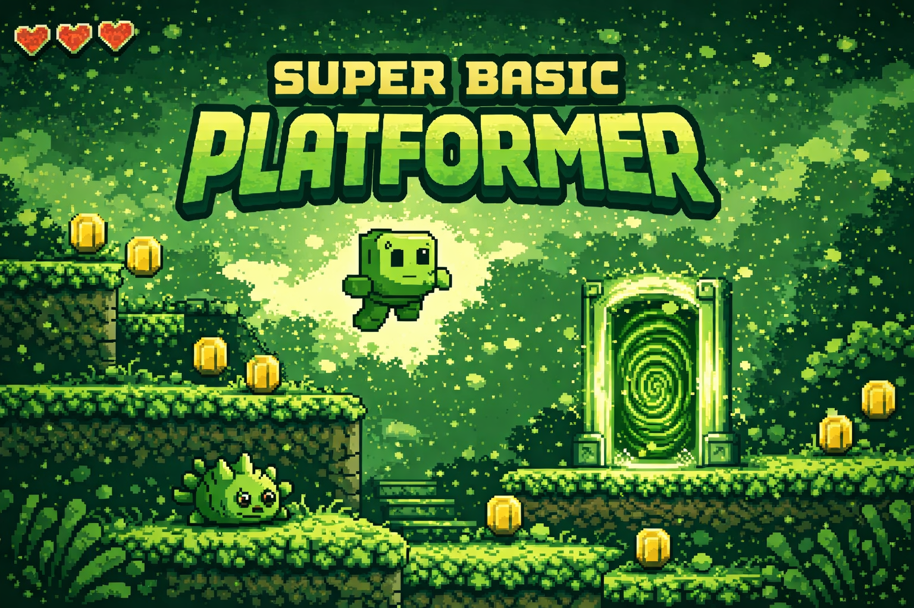

# Super Basic Platformer

<!-- splarg-storefront:start -->

  <strong><a href="https://splarg.itch.io/super-basic-platformer">▶ Play in browser on itch.io</a></strong>

  <a href="https://splarg.itch.io/super-basic-platformer">Screenshots & current public release</a> · <a href="https://splarg.com/">splarg.com</a>

<!-- splarg-storefront:end -->

<!-- splarg-itch-media:start -->

  

<!-- splarg-itch-media:end -->

A deliberately simple, Game Boy-styled browser platformer by **Splarg**.

Run and jump through procedurally generated levels, collect coins, stomp enemies and reach the portal at the end of each stage. The game tracks score, level and a local high score.

**Play on itch.io:** https://splarg.itch.io/super-basic-platformer

## Gameplay

- Procedurally generated platform sections
- Portal goal at the end of each level
- Coins for score
- Patrolling enemies that can be stomped
- Three-hit health system
- Heart drops can restore health
- Increasing level length/difficulty
- Keyboard and gamepad support
- Local high score
- Game Boy-inspired palette, scanlines and synthesised sound

## Controls

- **Left / Right Arrow** — move
- **Up Arrow / Space** — jump
- **Space** — start or restart
- Gamepad controls are also supported

## Run locally

There is no build step. Open the root `index.html` in a modern browser.

## Source status

The root `index.html` corresponds to the preserved itch.io release checked on **19 September 2026**. Where the archival copy differed from the supplied itch file, the differences were whitespace-only; executable source was otherwise unchanged.

Future fixes and development should be committed after that snapshot so the published-release state remains recoverable in Git history.

## Technology

HTML5 Canvas / CSS / JavaScript / Web Audio.
